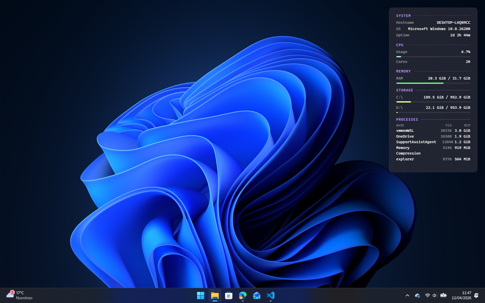

# Vitrine

A themeable desktop widget engine for Windows, inspired by [Conky](https://github.com/brndnmtthws/conky).

Vitrine renders a full-screen transparent overlay behind your desktop icons using WebView2, and loads themes built with React that display system information, custom widgets, or anything you can build with HTML/CSS/JS.



## Features

- Full-screen transparent overlay embedded behind desktop icons
- Themes are compiled React (JSX) bundles — full control over layout and style
- System info API (`window.vitrine.system`) exposes CPU, RAM, battery, storage, top processes
- Theme settings with categories, conditional visibility, and dynamic UI generation
- Control Panel (WPF + Fluent Design) for theme management and configuration
- Install themes from `.zip`, remove, switch — all from the Control Panel
- Configuration stored in `%APPDATA%\Vitrine\`
- Debug build with file logging for theme development

## Prerequisites

- Windows 10/11
- [.NET 9 SDK](https://dotnet.microsoft.com/download/dotnet/9.0)
- [Node.js 20+](https://nodejs.org/) (for building themes)
- [WebView2 Runtime](https://developer.microsoft.com/en-us/microsoft-edge/webview2/) (usually pre-installed on Windows 10/11)
- GNU Make

## Quick Start

```bash
make release
./publish/release/Vitrine.exe
```

A system tray icon appears. Double-click it or right-click and select **Open Control Panel** to manage themes and settings.

## Makefile

| Command | Description |
|---|---|
| `make build` | Build themes and .NET project (Release) |
| `make release` | Publish self-contained executable to `publish/release/` |
| `make debug` | Publish with logging enabled to `publish/debug/` |
| `make build-themes` | Compile all React themes in `src/themes/` |
| `make restore` | Restore NuGet packages |
| `make clean` | Clean all build artifacts and publish output |

## Project Structure

```
├── src/
│   ├── Vitrine.Engine/             # .NET WinForms + WebView2 host
│   │   ├── Core/
│   │   │   ├── DesktopAttacher     # Win32 Progman/WorkerW embedding
│   │   │   ├── ThemeHost           # Lifecycle, tray, config, system info bridge
│   │   │   ├── ThemeWindow         # Full-screen WebView2 Form
│   │   │   ├── Configuration       # %APPDATA% config.json management
│   │   │   └── Log                 # Debug-only file logger
│   │   ├── Panel/                  # WPF Control Panel (Fluent Design)
│   │   │   ├── ControlPanelWindow  # FluentWindow with NavigationView
│   │   │   ├── PageService         # IPageService for NavigationView
│   │   │   └── Pages/              # Home, Themes, Settings, About
│   │   ├── SystemInfo/
│   │   │   └── SystemInfoProvider  # CPU, RAM, battery, drives, processes
│   │   └── Themes/
│   │       ├── ThemeManifest       # theme.json model
│   │       └── SettingsDefinition  # settings.definitions.json model
│   └── themes/
│       └── default/                # Default Conky-style React theme
├── docs/                           # Documentation
│   ├── creating-themes.md          # How to create a theme
│   └── theme-settings.md           # How to add settings to a theme
├── Vitrine.sln
├── Makefile
└── Directory.Build.props           # Redirects bin/obj to .build/
```

## Documentation

- [Creating Themes](docs/creating-themes.md) — How to build a Vitrine theme from scratch
- [Theme Settings](docs/theme-settings.md) — How to add configurable settings with definitions

## System Info API

The `window.vitrine.system` API is injected into every theme:

```js
// Subscribe to periodic updates (every 2s)
window.vitrine.system.onUpdate((info) => { ... });

// One-shot request
const info = await window.vitrine.system.getInfo();
```

The `info` object:

```json
{
  "system": { "hostname": "DESKTOP-ABC", "os": "Microsoft Windows 10.0.22631", "uptime": 123456 },
  "cpu": { "usage": 23.5, "cores": 8 },
  "memory": { "total": 17179869184, "available": 8589934592, "used": 8589934592, "load": 50 },
  "battery": { "hasBattery": true, "charging": false, "level": 72, "remainingSeconds": 5400, "powerSource": "battery" },
  "drives": [{ "name": "C:\\", "label": "OS", "total": 500107862016, "free": 250053931008, "used": 250053931008 }],
  "processes": [{ "name": "chrome", "pid": 1234, "memory": 524288000 }]
}
```

> On desktops without a battery, `battery` returns `{ "hasBattery": false }`.

## Configuration

Stored in `%APPDATA%\Vitrine\`:

| Path | Purpose |
|---|---|
| `config.json` | Active theme selection |
| `themes/` | Installed themes (each with theme.json, theme.js, optional theme.css, settings, preview) |
| `logs/` | Debug build logs (daily rotation) |

## Control Panel

The Control Panel is a native WPF window using Fluent Design (WPF-UI) that matches the Windows 11 Settings app look and feel. It provides:

- **Home** — Active theme status, reload, quick actions
- **Themes** — Card view with preview images, install from `.zip`, remove, apply, per-theme settings
- **About** — Version and license

Open it by double-clicking the tray icon or via right-click menu.

## Debugging

```bash
make debug
./publish/debug/Vitrine.exe
```

Logs are written to `%APPDATA%\Vitrine\logs\vitrine-YYYY-MM-DD.log` and include the full startup sequence, WebView2 initialization, theme loading, and any JavaScript errors from the theme.

## License

[MIT](LICENSE)
